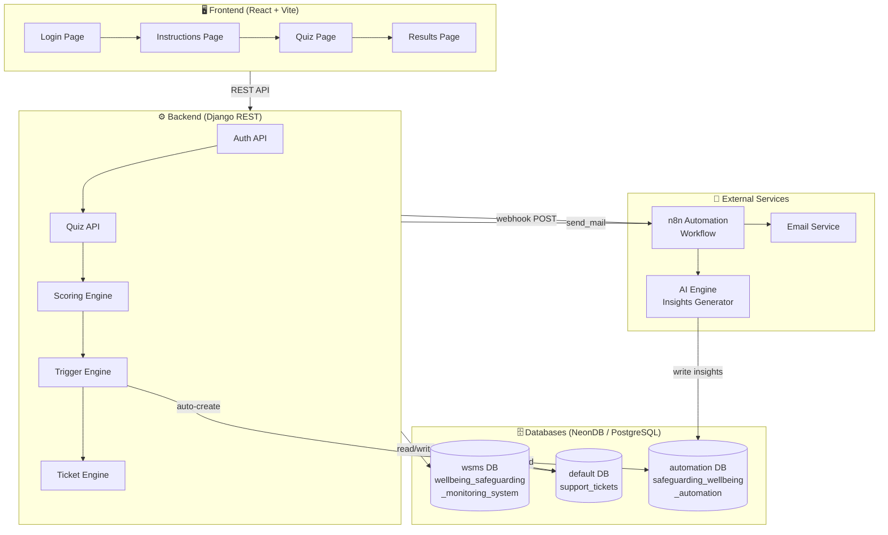
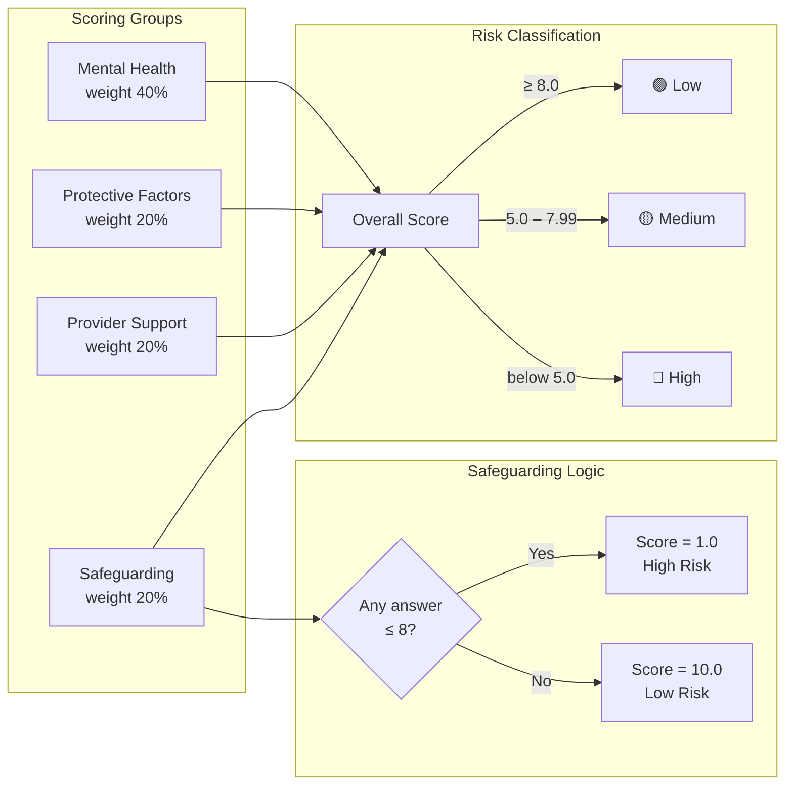
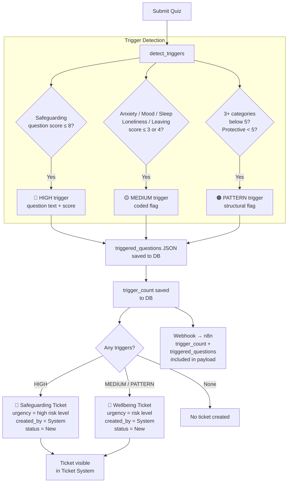
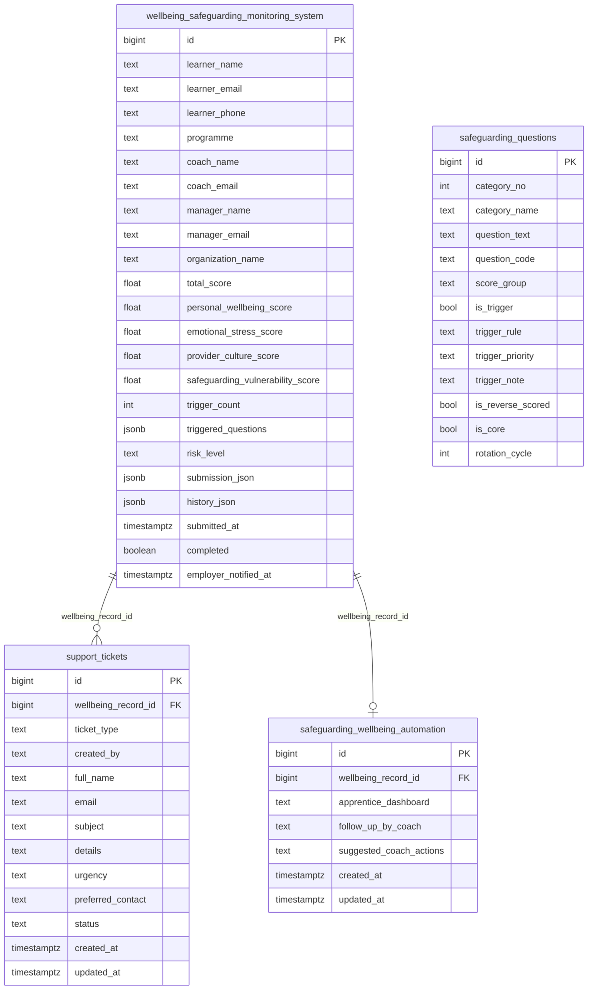

# Wellbeing & Safeguarding Monitoring System
### Technical Documentation

---

## Table of Contents
1. [Project Overview](#1-project-overview)
2. [System Architecture](#2-system-architecture)
3. [Quiz Flow](#3-quiz-flow)
4. [Scoring & Risk Engine](#4-scoring--risk-engine)
5. [Trigger & Ticket Flow](#5-trigger--ticket-flow)
6. [Database Schema](#6-database-schema)
7. [API Reference](#7-api-reference)
8. [Integrations](#8-integrations)
9. [Frontend UI Components](#9-frontend-ui-components)
10. [Changelog](#10-changelog)

---

## 1. Project Overview

The **Wellbeing & Safeguarding Monitoring System** is a digital check-in platform for apprentices at Kent Business College. Learners complete a wellbeing questionnaire, the system scores their responses, detects risk indicators, and automatically escalates concerns to the safeguarding and wellbeing teams through a structured ticketing workflow.

### Key Capabilities
| Capability | Description |
|---|---|
| Wellbeing Assessment | Scored questionnaire across 4 domains |
| Risk Classification | Automated Low / Medium / High scoring |
| Trigger Detection | Identifies safeguarding and wellbeing red flags |
| Auto-Ticketing | Creates support tickets automatically when risk is detected |
| AI Insights | Personalised dashboard generated via n8n + AI |
| Employer Notification | Optional nudge to employer (no scores shared) |

---

## 2. System Architecture



---

## 3. Quiz Flow


---

## 4. Scoring & Risk Engine



---

## 5. Trigger & Ticket Flow



---

## 6. Database Schema



---

## 7. API Reference

### Authentication
| Method | Endpoint | Description |
|---|---|---|
| POST | `/api/auth/login/` | Login with email, returns Bearer token |

### Quiz
| Method | Endpoint | Description |
|---|---|---|
| GET | `/api/quiz/instructions/` | Quiz instructions and learner info |
| POST | `/api/quiz/start/` | Start a quiz attempt |
| GET | `/api/quiz/questions/` | Get active questions (core + rotation) |
| POST | `/api/quiz/submit/` | Submit answers → score → detect triggers → auto-ticket |

### Results
| Method | Endpoint | Description |
|---|---|---|
| GET | `/api/quiz/results/:id/` | Get scores, risk level, triggers |
| GET | `/api/quiz/results/:id/automation-dashboard/` | Get AI-generated insights (poll until ready) |
| POST | `/api/quiz/results/:id/send-to-employer/` | Email results to manager/coach |
| POST | `/api/quiz/results/:id/notify-employer/` | Send employer a check-up nudge |

### Tickets
| Method | Endpoint | Description |
|---|---|---|
| POST | `/api/tickets/create/` | Learner manually submits a support ticket |

---

## 8. Integrations

### n8n Automation Webhook
Triggered on every quiz submission. Payload includes:

```json
{
  "attempt_id": 123,
  "wellbeing_record_id": 123,
  "learner": {
    "name": "John Smith",
    "email": "j.smith@email.com",
    "phone": "07700900123",
    "programme": "Business Admin L3",
    "organization_name": "Acme Ltd",
    "coach_name": "Lisa Carter",
    "coach_email": "l.carter@kbc.ac.uk",
    "manager_name": "Sarah Jones",
    "manager_email": "s.jones@acme.com"
  },
  "submitted_at": "2026-05-07T13:31:55Z",
  "risk_level": "High",
  "trigger_count": 3,
  "triggered_questions": {
    "high": [
      { "question_text": "I feel safe at home", "normalized_score": 5, "trigger_note": "..." }
    ],
    "medium": ["anxiety_high", "low_mood"],
    "pattern": ["three_categories_below_5"]
  },
  "result": { "scores": {}, "answers": [] }
}
```

### Ticket Sources
| `created_by` | Description |
|---|---|
| `System` | Auto-created by scoring engine when triggers are detected on quiz submission |
| `learner` | Manually submitted by the learner via the Results page support form |

### Score Group Weights
| Group | Weight | Trigger Logic |
|---|---|---|
| Mental Health | 40% | Average of normalized scores |
| Protective Factors | 20% | Average of normalized scores |
| Provider Support | 20% | Average of normalized scores |
| Safeguarding | 20% | Binary: any score ≤ 8 → 1.0, all > 8 → 10.0 |

---

## 9. Frontend UI Components

### Results Page — Wellbeing Summary Status Cards

The AI Wellbeing Summary section displays status cards for each assessed domain. Each card uses a colour-coded style based on the label returned from the AI:

| Label | Icon | CSS Class | Colour |
|---|---|---|---|
| `Improving` | `↑` | `status-improving` | Green (`#eef8f1`) |
| `Watch` | `◎` | `status-watch` | Amber (`#fff6e8`) |
| `Next step` | `→` | `status-next` | Lavender (`#f9f5ff`) |
| `Observation` | `◉` | `status-observation` | Blue (`#e8f4fd`) |

Labels are mapped in `STATUS_LABEL_MAP` in `frontend/src/pages/ResultPage.tsx`. Any unrecognised label falls back to `status-next`.

---

### Results Page — Skeleton Loader

While the AI automation dashboard data is being fetched (polling every 5 seconds, up to 60 seconds), a shimmer skeleton animation is shown in place of each AI section card.

- **CSS classes**: `.skeleton-bone`, `.skeleton-card`
- **Animation**: `@keyframes skeleton-shimmer` — horizontal gradient sweep
- Skeleton is replaced by real content as soon as polling returns a non-empty dashboard response

---

### Results Page — Safeguarding Referral Form

A full Safeguarding Referral Form is available to staff via the **"Submit Safeguarding Referral"** button on the Results page. The form follows the KBC SR-001 structure and is presented as a modal.

#### Form Structure (7 Parts)

| Part | Title | Fields |
|---|---|---|
| 1 | Referrer Details | Name, job title, phone, email, date, relationship to learner |
| 2 | Learner Details | Full name, DOB, gender, phone, email, address, apprenticeship programme |
| 3 | Concern Details | Category (abuse / neglect / self-harm / domestic violence / radicalisation / other), description, date/time of concern, immediate risk toggle |
| 4 | Risk Indicators | 12 checkboxes — physical signs, behaviour change, self-harm, domestic violence, substance misuse, safeguarding history, mental health crisis, financial exploitation, online risk, radicalisation, missing episodes, not engaging with support |
| 5 | Actions Taken | Actions taken so far, who else was informed |
| 6 | Consent | Whether learner was informed, reason if not, parental awareness (if under 18) |
| 7 | Declaration | Signature field and confirmation of accuracy |

On submit, the form builds a structured plain-text `details` string and POSTs to `POST /api/tickets/create/` with `ticket_type = "safeguarding"` and `created_by = "learner"`.

---

### Onboarding Dashboard - Main Assessment Actions

The Onboarding Dashboard in `frontend/src/pages/OnboardingPage.tsx` shows the learner's pre-assessment journey before the main safeguarding assessment.

The **Who I Am** external action is always visible in the Main Assessment panel, regardless of onboarding progress:

- Before all six onboarding questionnaires are complete, the panel shows the remaining step count next to the **Who I Am** button.
- After all six questionnaires are complete, the panel shows the main assessment action (**Begin Assessment** or **Safeguarding Dashboard**) next to **Who I Am**.
- The **Who I Am** link passes the learner email as a query parameter: `https://who-i-am.kentbusinesscollege.net/?email={learner_email}`

Relevant CSS classes in `frontend/src/styles.css`:

| Class | Purpose |
|---|---|
| `.ob-main-remaining` | Displays the remaining onboarding step count as a compact pill |
| `.ob-who-i-am-btn` | Styles the Who I Am action as a secondary button |
| `.ob-sel-btn--purple + .ob-who-i-am-btn` | Aligns Who I Am beside the primary assessment button |
| `.ob-main-remaining + .ob-who-i-am-btn` | Aligns Who I Am beside the remaining-step pill |

On small screens, both the remaining-step pill and the action buttons become full-width stacked controls.

---

### Login Page — KBC Branding

- KBC logo (`/kbc-logo.png`) is displayed centred above the login form using `.login-logo-wrap` / `.login-logo`
- The same logo is used as the browser tab favicon via `<link rel="icon" href="/kbc-logo.png">` in `frontend/index.html`
- Logo file must be placed at `frontend/public/kbc-logo.png`

---

## 10. Changelog

### v2.9 - Onboarding Action Updates (2026-06)
- Updated the Onboarding Dashboard so **Who I Am** remains visible whether onboarding is incomplete or complete
- Restyled Main Assessment panel actions so **Who I Am** aligns consistently beside either the remaining-step pill or the primary assessment button
- Added responsive mobile handling for stacked onboarding action controls

### v2.8 — UI & Referral Form (2026-05)
- Added **Safeguarding Referral Form** (7-part modal, KBC SR-001 structure) to Results page
- Added **Observation** status card with blue colour scheme to Wellbeing Summary
- Added **skeleton loader** shimmer animation while AI dashboard polls
- Added **KBC logo** to Login page and as browser favicon
- Fixed polling logic: switched from timestamp comparison to content-based check (`Object.keys(dashboard).length > 0`) to prevent stale data on page refresh

### v2.5 — Auto-Ticketing & Triggered Questions (2026-04)
- Added `triggered_questions` JSONField to `wellbeing_safeguarding_monitoring_system` table
- Auto-ticket creation in `submit_quiz_view` when `trigger_count > 0`
- Ticket `details` includes structured breakdown: risk level, total score, trigger count, programme, coach, and per-question triggered scores
- Removed `source` column from `support_tickets`; origin is now identified by `created_by` (`System` vs `learner`)
- Risk level stored in `urgency` column of `support_tickets` (removed separate `risk_level` column)
- `triggered_questions` payload included in n8n automation webhook
- Removed email sending from manual ticket creation — DB storage only
