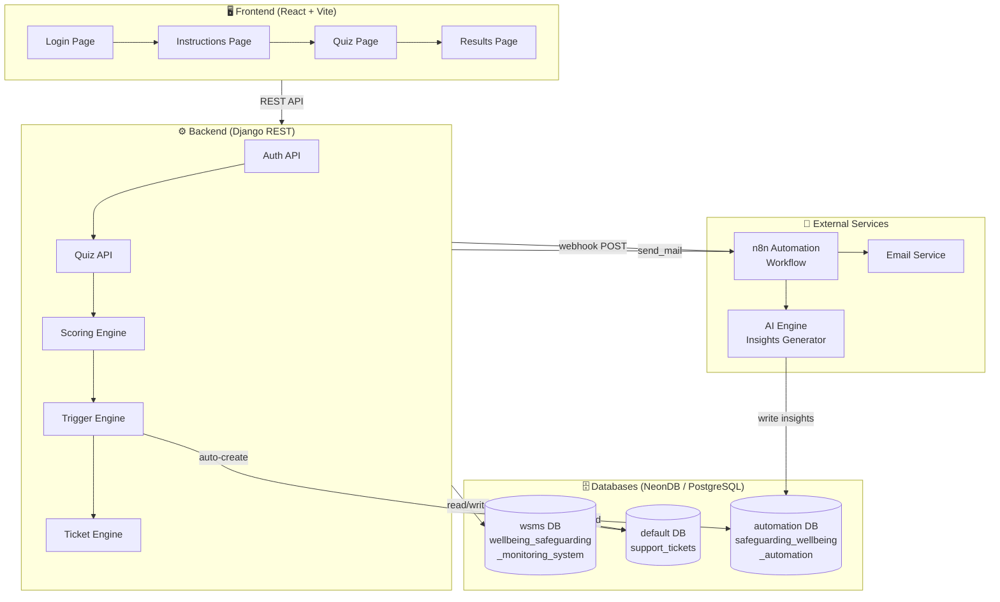
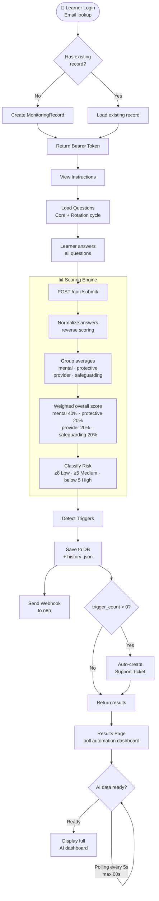
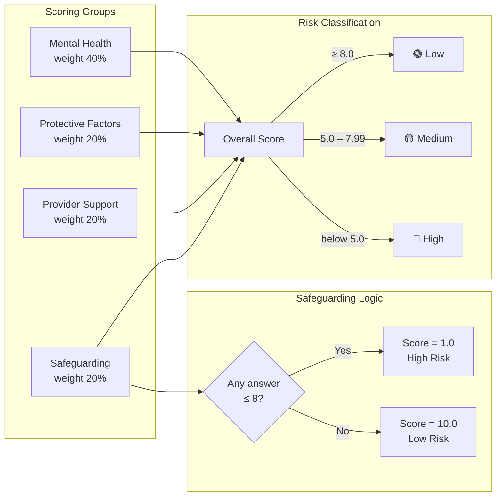
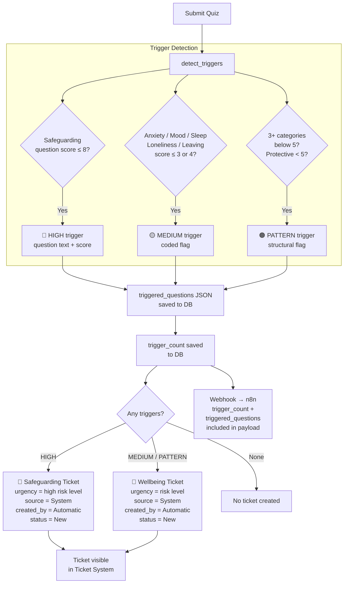
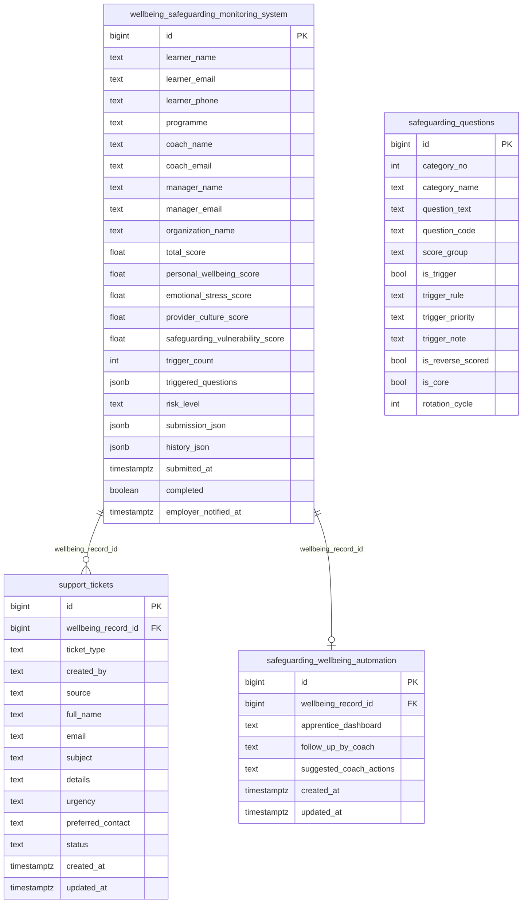

# Wellbeing & Safeguarding Monitoring System
### Technical Documentation

---

## Table of Contents
1. [Project Overview](#1-project-overview)
2. [System Architecture](#2-system-architecture)
3. [Quiz Flow](#3-quiz-flow)
4. [Scoring & Risk Engine](#4-scoring--risk-engine)
5. [Trigger & Ticket Flow](#5-trigger--ticket-flow)
6. [Database Schema](#6-database-schema)
7. [API Reference](#7-api-reference)
8. [Integrations](#8-integrations)

---

## 1. Project Overview

The **Wellbeing & Safeguarding Monitoring System** is a digital check-in platform for apprentices at Kent Business College. Learners complete a wellbeing questionnaire, the system scores their responses, detects risk indicators, and automatically escalates concerns to the safeguarding and wellbeing teams through a structured ticketing workflow.

### Key Capabilities
| Capability | Description |
|---|---|
| Wellbeing Assessment | Scored questionnaire across 4 domains |
| Risk Classification | Automated Low / Medium / High scoring |
| Trigger Detection | Identifies safeguarding and wellbeing red flags |
| Auto-Ticketing | Creates support tickets automatically when risk is detected |
| AI Insights | Personalised dashboard generated via n8n + AI |
| Employer Notification | Optional nudge to employer (no scores shared) |

---

## 2. System Architecture



---

## 3. Quiz Flow



---

## 4. Scoring & Risk Engine



---

## 5. Trigger & Ticket Flow



---

## 6. Database Schema



---

## 7. API Reference

### Authentication
| Method | Endpoint | Description |
|---|---|---|
| POST | `/api/auth/login/` | Login with email, returns Bearer token |

### Quiz
| Method | Endpoint | Description |
|---|---|---|
| GET | `/api/quiz/instructions/` | Quiz instructions and learner info |
| POST | `/api/quiz/start/` | Start a quiz attempt |
| GET | `/api/quiz/questions/` | Get active questions (core + rotation) |
| POST | `/api/quiz/submit/` | Submit answers → score → detect triggers → auto-ticket |

### Results
| Method | Endpoint | Description |
|---|---|---|
| GET | `/api/quiz/results/:id/` | Get scores, risk level, triggers |
| GET | `/api/quiz/results/:id/automation-dashboard/` | Get AI-generated insights (poll until ready) |
| POST | `/api/quiz/results/:id/send-to-employer/` | Email results to manager/coach |
| POST | `/api/quiz/results/:id/notify-employer/` | Send employer a check-up nudge |

### Tickets
| Method | Endpoint | Description |
|---|---|---|
| POST | `/api/tickets/create/` | Learner manually submits a support ticket |

---

## 8. Integrations

### n8n Automation Webhook
Triggered on every quiz submission. Payload includes:

```json
{
  "attempt_id": 123,
  "wellbeing_record_id": 123,
  "learner": {
    "name": "John Smith",
    "email": "j.smith@email.com",
    "phone": "07700900123",
    "programme": "Business Admin L3",
    "organization_name": "Acme Ltd",
    "coach_name": "Lisa Carter",
    "coach_email": "l.carter@kbc.ac.uk",
    "manager_name": "Sarah Jones",
    "manager_email": "s.jones@acme.com"
  },
  "submitted_at": "2026-05-07T13:31:55Z",
  "risk_level": "High",
  "trigger_count": 3,
  "triggered_questions": {
    "high": [
      { "question_text": "I feel safe at home", "normalized_score": 5, "trigger_note": "..." }
    ],
    "medium": ["anxiety_high", "low_mood"],
    "pattern": ["three_categories_below_5"]
  },
  "result": { "scores": {}, "answers": [] }
}
```

### Ticket Sources
| `created_by` | `source` | Description |
|---|---|---|
| `Automatic` | `System` | Created by scoring engine when triggers detected |
| `learner` | _(null)_ | Created manually by learner via Results page |

### Score Group Weights
| Group | Weight | Trigger Logic |
|---|---|---|
| Mental Health | 40% | Average of normalized scores |
| Protective Factors | 20% | Average of normalized scores |
| Provider Support | 20% | Average of normalized scores |
| Safeguarding | 20% | Binary: any score ≤ 8 → 1.0, all > 8 → 10.0 |
